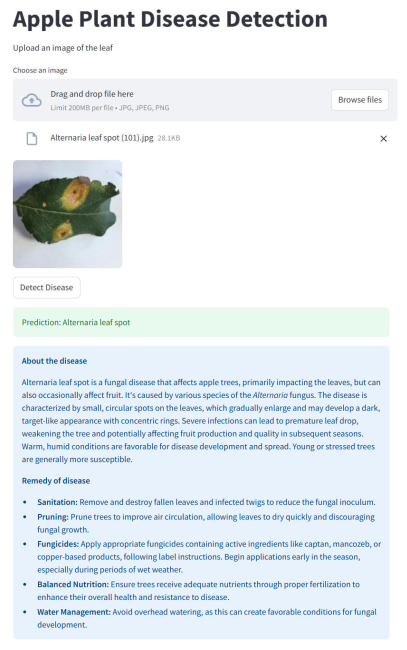

# 🍏 Apple Leaf Disease Detection using Vision Transformer (ViT)

An end-to-end deep learning project for **apple leaf disease classification** using a custom-built **Vision Transformer (ViT)**, combined with **LLM-based remediation suggestions** via Gemini API.

---

## 📑 Table of Contents

- [Overview](#-overview)
- [Features](#-features)
- [Dataset](#-dataset)
- [Project Structure](#-project-structure)
- [How It Works](#-how-it-works)
- [Model Details](#-model-details)
- [Results](#-results)
- [Demo / Screenshots](#-demo--screenshots)
- [Installation](#-installation)
- [Usage](#-usage)
- [Future Improvements](#-future-improvements)
- [Author](#-author)

---

## 📌 Overview

This project uses a **Vision Transformer (ViT)** to classify apple leaf diseases from images.  
After prediction, a **Gemini LLM** generates:

- Disease description  
- Suggested remedies  

A **Streamlit web app** provides an easy-to-use interface.

---

## 🚀 Features

- Custom Vision Transformer (ViT) implementation  
- Image-based apple leaf disease classification  
- LLM-powered remediation suggestions  
- Streamlit interactive UI  
- Pretrained model for quick inference  
- Clean modular project structure  

---

## 📂 Dataset

Due to large size, the dataset is **not included** in this repository.

Instead, refer to:
Dataset/dataset_description.txt

It contains:
- Dataset name (AL9EE)
- Class details
- Download link
- Setup instructions

### 🌿 Classes

- Alternaria leaf spot  
- Brown spot  
- Frogeye leaf spot  
- Grey spot  
- Healthy  
- Mosaic  
- Powdery mildew  
- Rust  
- Scab  

---

## ⚙️ How It Works

1. User uploads an apple leaf image  
2. Image is preprocessed  
3. ViT model predicts disease class  
4. Prediction is sent to Gemini API  
5. Output includes:
   - Disease name  
   - Description  
   - Remedies  

---

## 🧠 Model Details

- Architecture: Vision Transformer (ViT)
- Framework: TensorFlow / Keras
- Input: Image patches
- Components:
  - Patch embedding
  - Positional encoding
  - Transformer encoder blocks
  - Classification head

---

## 📊 Results

| Metric              | Value   |
|--------------------|--------|
| Training Accuracy  | 90%    |
| Validation Accuracy| 85%    |
| Test Accuracy      | 88.9%  |
| F1 Score (Weighted)| 0.891  |

---

## 📸 Demo / Screenshots

🛠️ Installation

1.Clone the repository

git clone https://github.com/your-username/APPLE_VIT.git
cd APPLE_VIT

2.Create virtual environment

python -m venv venv

3.Activate environment

Windows -> venv\Scripts\activate

Linux/macOS -> source venv/bin/activate

If not available:

pip install tensorflow streamlit numpy pillow matplotlib scikit-learn

▶️ Usage

Run Streamlit App -> streamlit run vit_streamlit.py